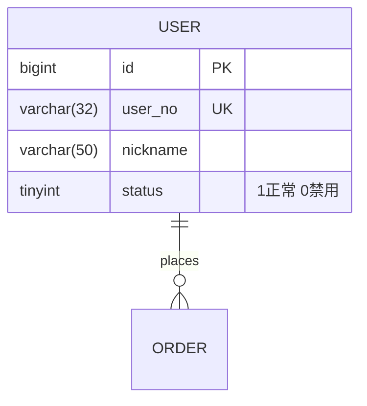

# 数据库建模Skill

## 适用场景
架构设计阶段,把业务对象转化为数据库模型,输出 ER 图与表结构说明,作为后端开发输入。

## 执行步骤
1. 从 PRD/对象模型提取实体与关系(1:1 / 1:N / N:M)。
2. 按规范化设计表:先满足三范式,再按查询性能做受控反范式。
3. 定义字段:类型、长度、是否可空、默认值、说明。
4. 设计索引:主键、唯一键、查询索引、联合索引(按查询模式)。
5. 输出 ER 图(Mermaid erDiagram)+ 表结构说明。

## 规范要点
- 命名:表名/字段名 snake_case,表名复数或单数全库统一;布尔字段 is_/has_ 前缀;时间 _at 结尾。
- 每表必备:主键 id、create_time、update_time(审计类加 create_by/update_by)。
- 金额用 DECIMAL 不用 FLOAT;状态字段用 TINYINT/枚举并注释取值含义。
- 外键:物理外键或应用层约束全库统一;N:M 用中间表。
- 大表提前规划:分区键/归档策略/预计数据量写入说明。
- 敏感字段标注脱敏与加密要求(联动数据安全规范)。

## 输出模板

## 自检清单
- [ ] 实体与关系完整映射 PRD
- [ ] 字段含类型/可空/默认值/说明
- [ ] 索引与查询模式匹配
- [ ] 命名规范统一
- [ ] 敏感字段标注保护要求
